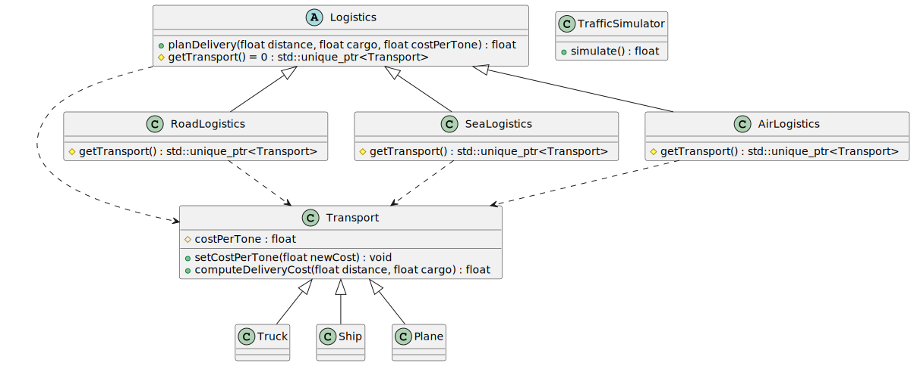
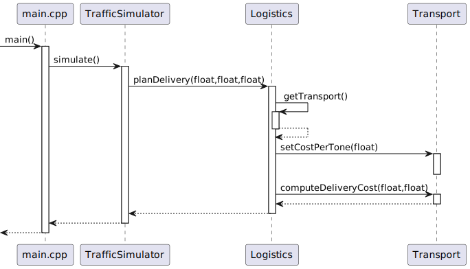

# Problem

Let's consider a freight transportation management program. 

A logistics company (class **LogisticCompany**) is engaged in the transportation of goods, which delivers goods (class **Logistics**) by trucks (class **Truck**). Over time, the company grows and decides to deliver by other types of transport (sea, air, etc.).

[Refactor](https://github.com/krenevych/design-patterns-java/tree/main/Java/lab02_Factory_Method/task_2_1) the application using the Factory Method design pattern. Add the ability to implement cargo transportation
- by sea
- by air
---
# Solution
## Class diagram

## Sequence diagram

