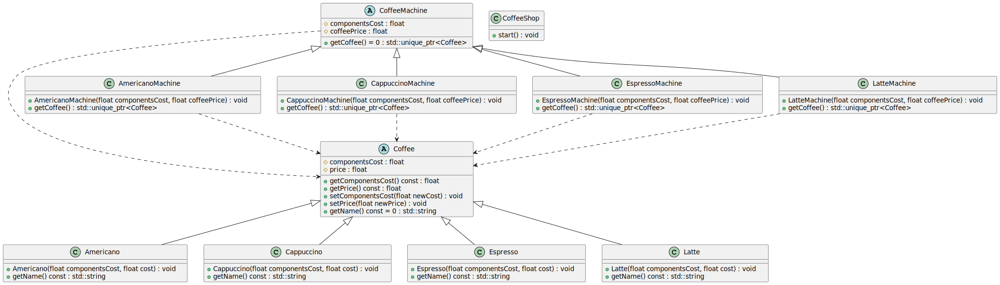
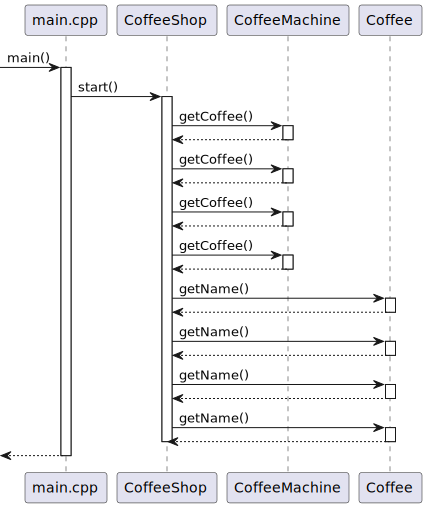

# Problem: Coffee shop in MechMat Mall.
The quarantine that hindered the development of the restaurant business is now over. Ivan decides to start his own business and decides to start with a small coffee shop in the MechMat Mall.

Initially, he planned to serve the following four drinks: Espresso, Americano, Cappuccino, and Latte. Each of these drinks has a cost price, which consists of the total cost of the components that make up the drink and the cost of selling it to the customer. 

Help Ivan in this difficult task. Model the work of this coffee shop by implementing the **Factory Method** template and calculate the profit that this coffee shop will receive over a certain period of time. Expand the range of drinks in the coffee shop with other drinks.

---
# Solution
## Class diagram

## Sequence diagram
