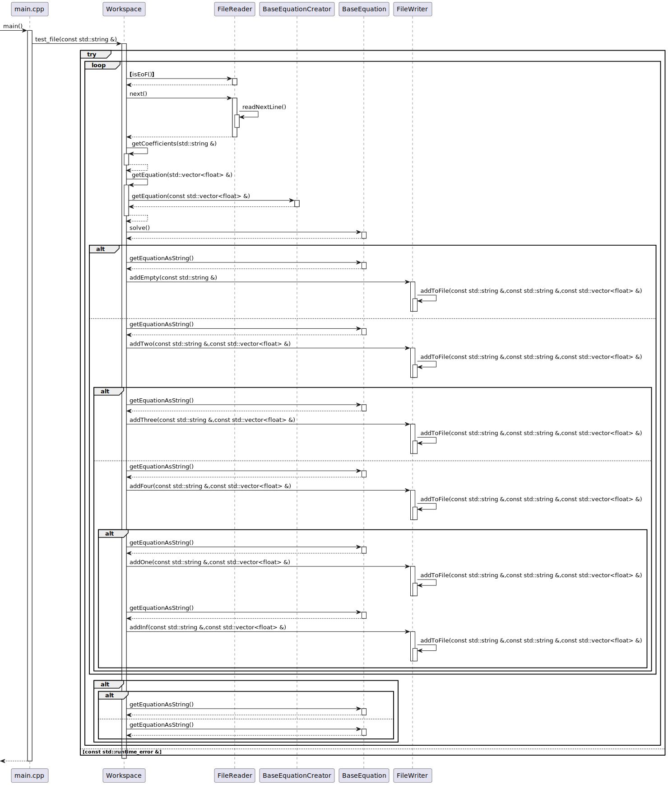
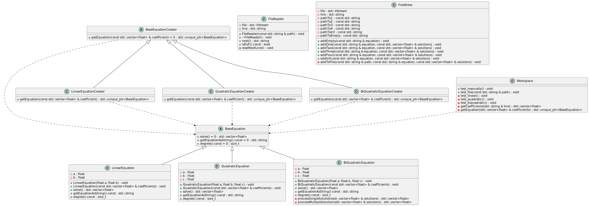

# Problem
## 1. Part
Describe the **Equation** class that models a linear algebraic equation of the form
$$bx+c=0$$
Describe a **solve()** method that returns all solutions to this equation, depending on its coefficients. 

Create the **QuadraticEquation** and **BiQuadraticEquation** classes, which are descendants of the Equation class and model equations of the form
$$ax^2+bx+c=0$$
and
$$ax^4+bx^2+c=0$$
respectively.

In these classes, place a **solve()** method that solves each of these equations, returning a list of its solutions.

## 2. Part
Using the above class hierarchy, solve the following problem: 

You are given a list of equations, each of which is defined by a list of coefficients starting with the coefficient at the highest degree.

For example, the linear equation $2x+1=0$ is defined by the list $[2, 1]$, the quadratic equation $3x^2+x+6=0$ by the list $[3, 1, 6]$, and the bi-quadratic equation $3x^4+5x^2+6=0$ by the list $[3, 0, 5, 0, 6]$.

All equations are saved in a text file - the list of coefficients of each equation is placed on a separate line. The coefficients are separated by one or more space characters. 

Among the given equations, find those that
- have no solutions;
- have one solution;
- have two solutions;
- have three solutions;
- have four solutions;
- has an infinite number of solutions.

In addition, indicate the equation that has
- the smallest solution,
- the largest solution,
among the solutions of all equations that have exactly one solution.

Solve the problem for each set of input data. The input data is contained in the files:
- input01.txt
- input02.txt
- input03.txt

---
# Solution
## Class diagram

## Sequence diagram
