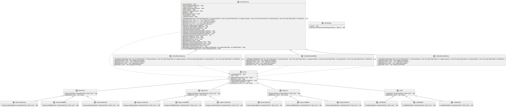
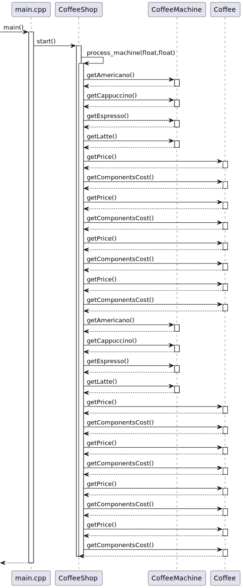

# Problem
After a successful launch of his own coffee shop (see the problem from 1. FactoryMethod), Ivan wants to try selling coffee made by different coffee machine manufacturers to find the best option in terms of profit from:
- coffee sales
- cost of drinks
- cost of the coffee machine
- cost of its maintenance

Help Ivan to make a choice based on the fact that Ivan plans to make a profit within N days.

To do this, implement the Abstract Factory template, each specific implementation of which is responsible for a specific coffee machine manufacturer.

---
# Solution
## Class diagram

## Sequence diagram
