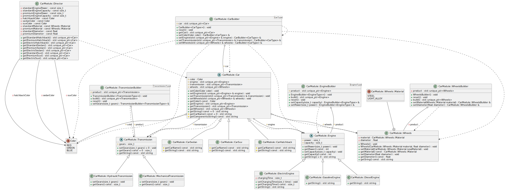
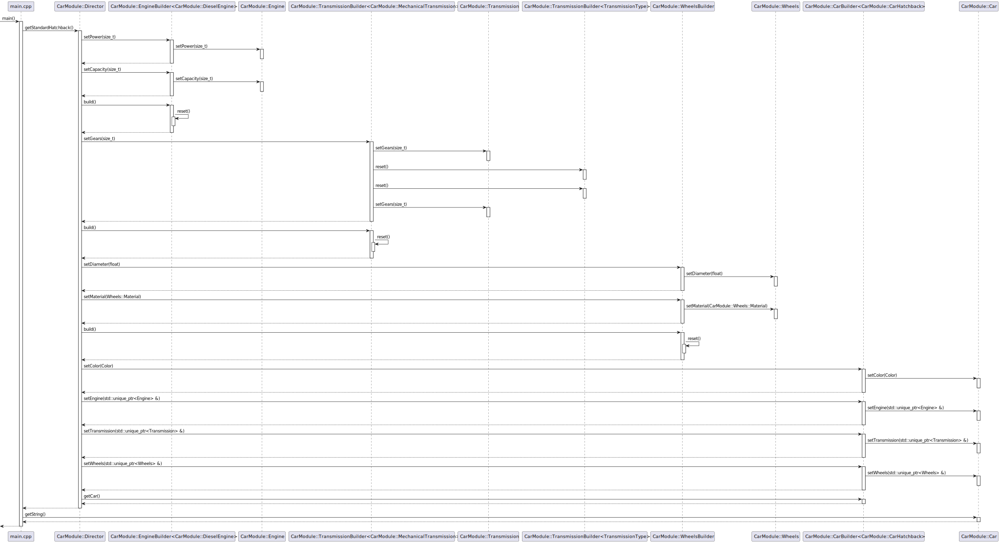

# Problem: automobile plant
The car manufacturing process is a complex multi-step process, as a car consists of a large number of individual components, each of which may have a list of its own characteristics. 

Consider the class **Car**, which has such attributes as body type (e.g., sedan, hatchback, SUV, etc.), engine, transmission, wheels, tires, body color, etc. In turn, car attributes can have their own attributes, for example, the engine has power, displacement, torque, type of fuel used. Wheels are made of different materials (steel, alloy materials) and come in different diameters. The transmission, in turn, can be manual or automatic and has a certain number of gears. 

Implement the Builder template to make a car. For each complex component part, create its own builder.

In addition, create a **Director** class whose task will be to combine the complex process of making a car into one whole. In the **Director** class, implement methods for creating different types and classes of cars.

---
# Solution
## Class diagram

## Sequence diagram
