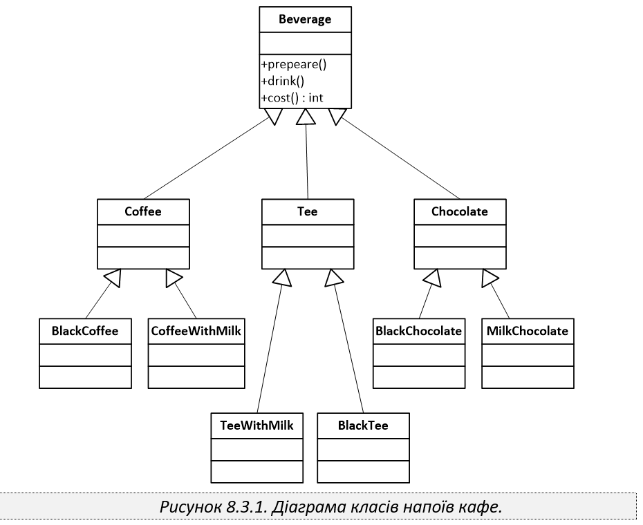
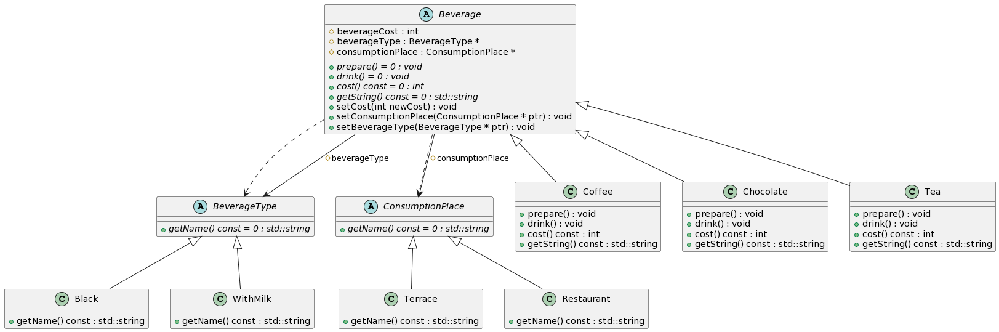
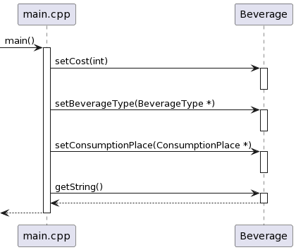

# Problem
Consider the class diagram shown in Figure 8.3.1, which describes the structure of the drinks produced in a small coffee shop.

Refactor the classes of this project using the Bridge design pattern. After that, add the appropriate classes for the possibility of preparing drinks for consumption both in the restaurant and take-away.

---
# Solution
## Class diagram

## Sequence diagram
