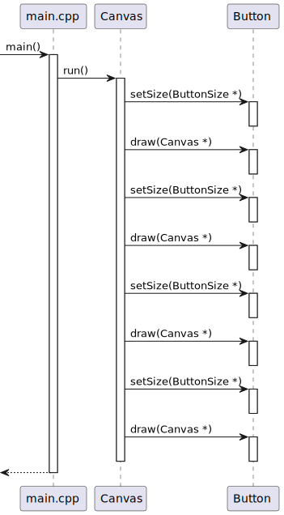

# Problem
Refactor the code [Link](https://github.com/krenevych/design-patterns-java/tree/main/Java/lab08_Bridge/task_3_2) using the Bridge design pattern. After implementing the Bridge template, extend the project by adding a new ImageButton class and a new UserSize class.

---
# Solution
## Class diagram

## Sequence diagram
