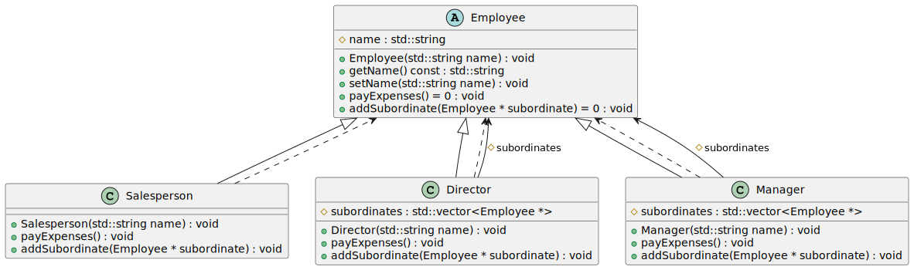

# Problem
Consider a store model that contains two types of employees - managers and salespeople. All store employees receive salaries according to their position. Our model calculates salaries for all employees of the store.

Refactor the code using the Composite design pattern so that the program can calculate the payment of wages to employees of a supermarket headed by a director (manager) with three departments (meat department, dairy department, confectionery department), each headed by a manager, and containing at least three salespeople. 

---
# Solution
## Class diagram
